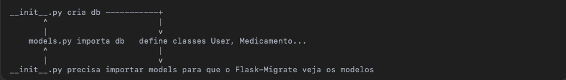

## Anotações

- Estrutura:
  1. criação do db em **init**.py
  2. definição das Class User, medication... em models.py
  3. Importação models para que o Flask-Migrate veja os models em **init**.py
     <br/><br/>
     

### Configurando TailwindCSS para o projeto

1. Inicializar o Node.js no projeto

```
npm init -y
```

2. Instale o Tailwind e dependências

```
npm install -D tailwindcss@3 postcss auto-prefixer
npx tailwindcss init
```

3. Crie a estrutura do diretório(como preferir):

```
mkdir -p app/static/css
touch app/static/css/tailwind.css
```

4. Edite o arquivo tailwind.config.js

```
module.exports = {
  content: ["./app/templates/**/*.html"],
  theme: {
    extend: {},
  },
  plugins: [],
}
```

5. Edite app/static/css/tailwind.css

```
@tailwind base;
@tailwind components;
@tailwind utilities;
```

6. Crie ou edite o arquivo postcss.config.js

```
module.exports = {
  plugins: {
    tailwindcss: {},
    autoprefixer: {},
  },
}
```

7. Compilar o Tailwind

```
npx tailwindcss -i ./app/static/css/tailwind.css -o ./app/static/css/output.css --watch
```

### Gerando e Aplicando script de migração

1. Definindo FLASK_APP

```
export FLASK_APP=run.py
```

2. Inicializando o banco

```
flask db init
```

3. Gerando script de migração

```
flask db migrate -m "Aplicar sua mensagem aqui"
```

4. Aplicar a migração ao banco de dados

```
flask db upgrade
```
